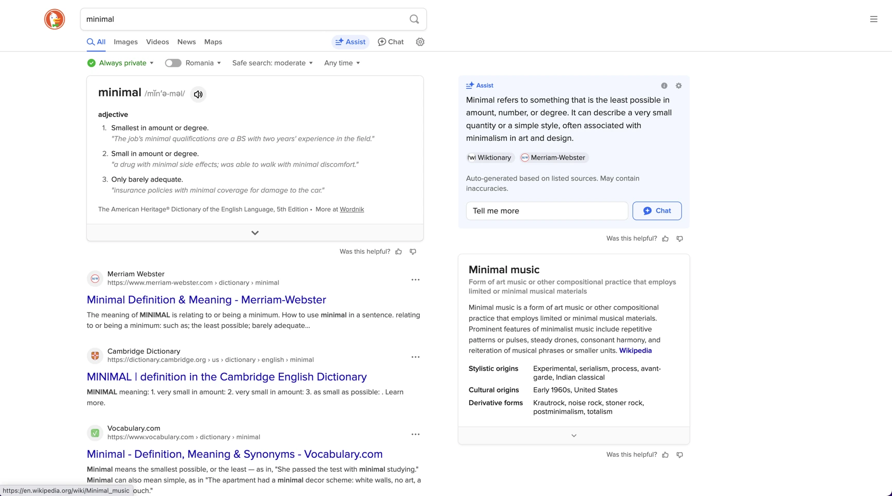
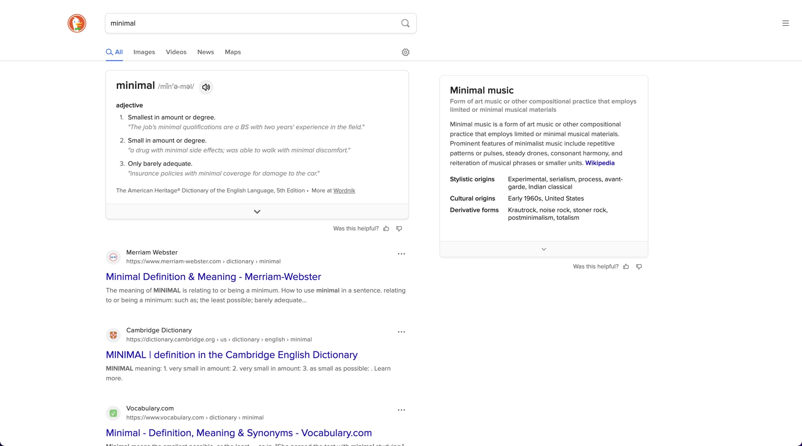

# 🦆 DuckDuckGo Minimal Theme

A cleaner interface for DuckDuckGo search results.

**Before:**

**After:**

**About**  
After struggling to switch from Google due to privacy concerns, I found other engines' interfaces—including DuckDuckGo—too cluttered. This extension applies CSS tweaks that:  
- Remove distractions (AI elements, download prompts, footer)  
- Increases spacing for visual clarity  
- Make results feel clean and purposeful  

**Installation**  
1. Download from [Chrome Web Store]()  
2. Refresh your DuckDuckGo tab  

**About**  
Press the extension icon to toggle the theme on/off. Try it out and see the difference!

**Disclaimer**  
⚠️ This is **not** an official DuckDuckGo extension.  
